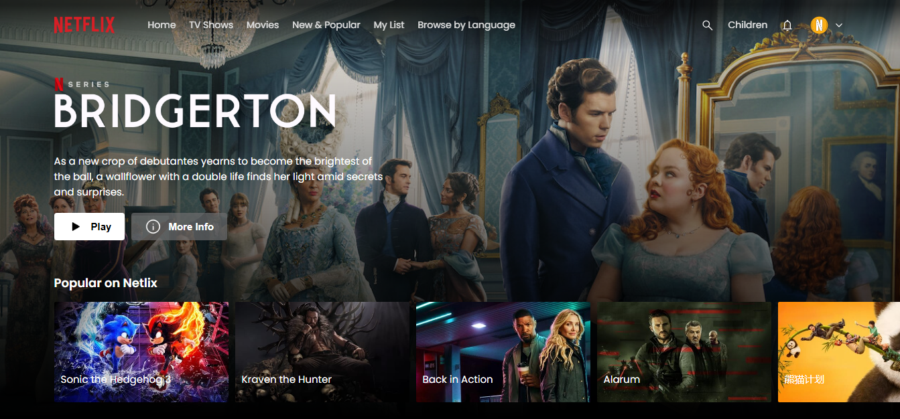
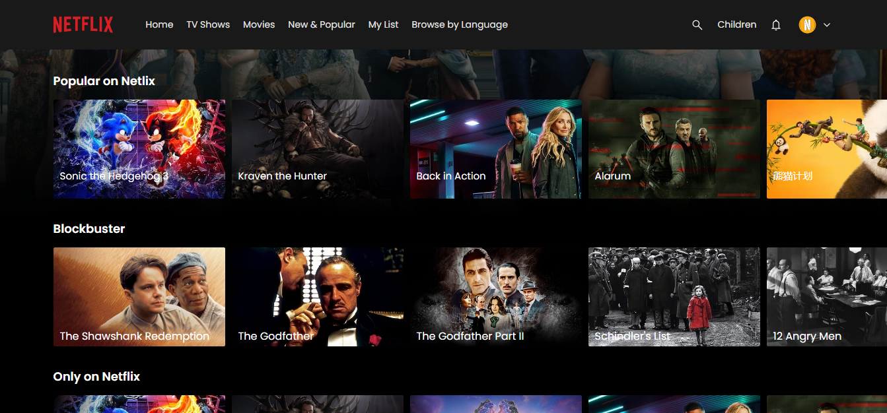
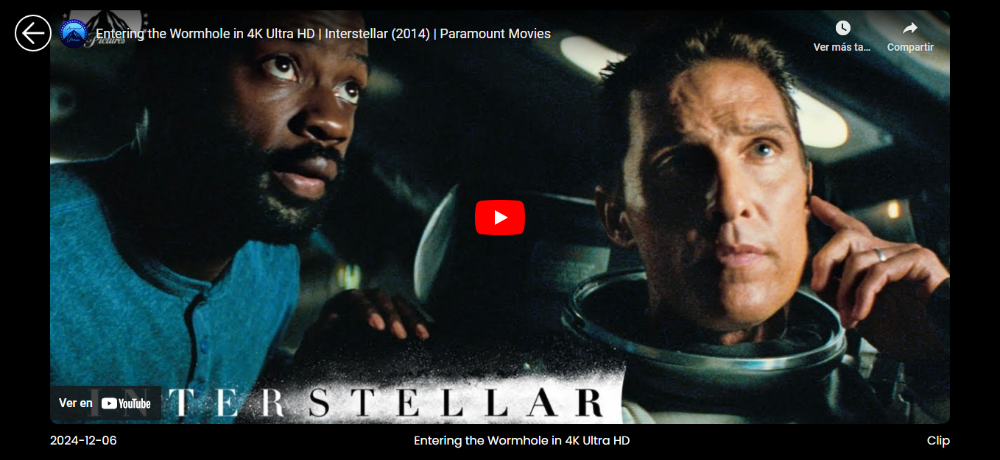
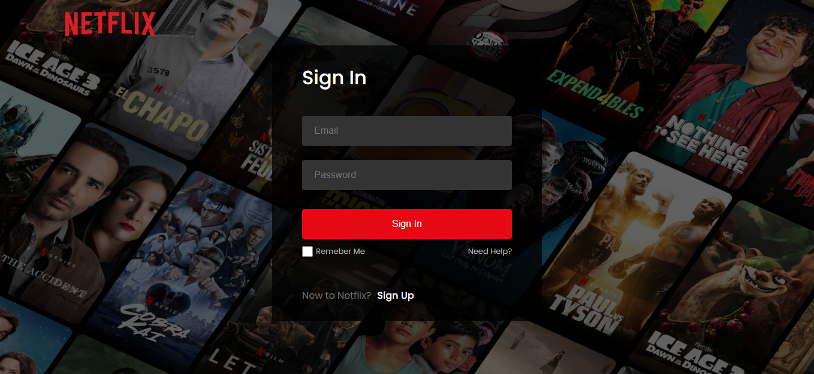
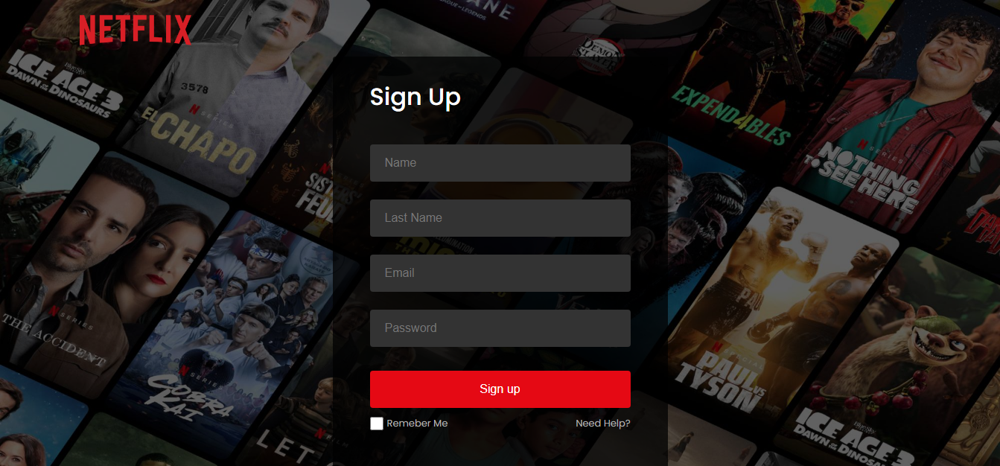

# 🎬 Netflix Clone with React + Vite

This is a Netflix clone developed with React and Vite. The project allows users to explore movies and TV shows using the TMDB API, which provides access to the latest information about blockbusters and popular titles in various categories (such as Recent Movies, Recent TV Shows, etc.). It also includes a user authentication system using Firebase, which allows users to sign up and log in to personalize the experience.

## 📌 Key Features:

- **Browse Movies and TV Shows**: Users can browse the latest movies and TV shows, and filter content based on popular categories provided by the TMDB API.
- **Firebase Authentication**: Users can sign up and log in using Firebase Authentication, allowing for a personalized experience.
- **Firestore Database**: User data, such as name and email, are securely stored in Firestore.
- **Details and trailers**: Clicking on a movie or series displays the trailer for it along with details such as synopsis, genre, release date, etc. (although full content cannot be played as it is a clone).
- **Modern user interface**: The interface is designed to resemble Netflix's, providing a visually appealing and fluid experience.

## 🚀 Technologies used

The project was built using the following technologies:

- **React**: For building the frontend.
- **Vite**: As a JavaScript bundler for fast and efficient development.
- **TMDB API**: To obtain information about movies and series (including trailers).
- **Firebase Authentication**: To handle the user login and registration system.
- **Firestore**: To store user information.

## 📸 Screenshots

#### 1. Home Screen



#### 2. Movie Navigation



#### 3. Trailer View



#### 4. User Login



#### 5. User Registration



## 🛠 Installation and Launch

#### 1. Clone the repository:

```sh
git clone https://github.com/your-user/your-repo.git
```

#### 2. Enter the project folder:

```sh
cd project-name
```

#### 3. Install the dependencies:

```sh
npm install
```

#### 4. Create a .env file and add your environment variables.

#### 5. Start the development server:

```sh
npm run dev
```

## 🔑 Environment Variables

Before running the project, you must set the following environment variables.
Create a `.env` file in the project root and add the following:

#### 🔥 Firebase Config

---

```env
VITE_FIREBASE_API_KEY=your_api_key
VITE_FIREBASE_AUTH_DOMAIN=your_auth_domain
VITE_FIREBASE_PROJECT_ID=your_project_id
VITE_FIREBASE_STORAGE_BUCKET=your_storage_bucket
VITE_FIREBASE_MESSAGING_SENDER_ID=your_messaging_sender_id
VITE_FIREBASE_APP_ID=your_app_id
```

#### 🎬 TMDB API

---

```env
VITE_TMDB_AUTH_TOKEN=your_tmdb_auth_token
```

## 🌍 Project in Line

🔗 [See the project here](https://my-project.vercel.app/)

## 👨‍💻 Author

Created by [Juan Amador](https://github.com/juanamador1009).
